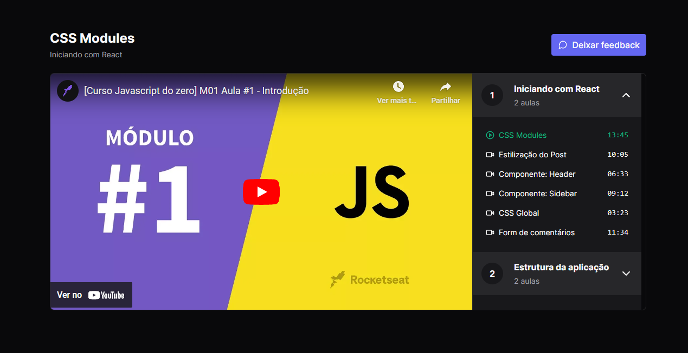

<h1 align="center"> React + Redux + Zustand </h1>

A video player app using Redux + Zustand as state-management.  

  <a href="#-tecnologies">Tecnologies</a>&nbsp;&nbsp;&nbsp;|&nbsp;&nbsp;&nbsp;
  <a href="#license">License</a>

 

  

  

## 🚀 Tecnologias

This project was developed with the following technologies:

- TypeScript
- Redux
- Zustand
- Vitest
- Tailwind
- Axios
- React Player
- JSON Server

## :memo: License

This project is licensed under the MIT license.

---

Made by ♥ gustavosalviato :wave: [contact](https://www.linkedin.com/in/gustavo-salviato-910048212/)
